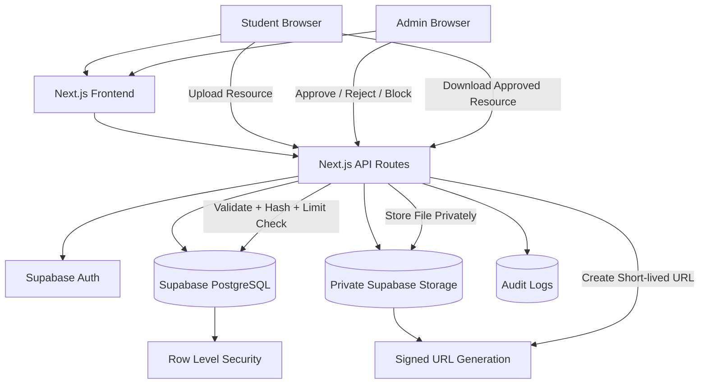

# Secure Campus Resource Sharing & Moderation Platform

A security-first full-stack platform for college students to upload, request, review, and download academic resources such as notes, previous-year papers, lab files, and study material.

Unlike a basic file-sharing website, this project uses a **moderation-first workflow**: uploads are validated server-side, stored privately, reviewed by an admin, and only then made visible to students through short-lived signed download links.

## Live Demo

Live App: https://secure-campus-resource-hub.vercel.app

Users can create their own **student account** using the Register page.

Admin access is private and is **not shared publicly** for security reasons. This project does not publish demo admin credentials. Admin access is controlled through the `ADMIN_EMAILS` environment variable.

> Do not use a personal admin account as a demo account. Do not publish admin/student passwords in GitHub, README, screenshots, or deployment notes.

---

## Problem Statement

In colleges, academic resources are usually scattered across WhatsApp groups, old drives, personal chats, or senior-junior networks. Students often struggle to find verified notes, lab files, and previous-year papers. At the same time, open upload portals can be misused for spam, duplicates, unsafe files, or inappropriate content.

This project solves that by providing a centralized resource-sharing platform with:

- verified public resources,
- admin moderation before visibility,
- duplicate detection,
- private storage,
- signed downloads,
- student requests,
- audit logs,
- and role-based access control.

## Why This Project Is Different

This is not just a CRUD or upload/download app.

It includes real-world security and moderation decisions:

- Student uploads are saved as `PENDING_REVIEW`.
- Only admin-approved resources become public.
- Files are stored in a **private Supabase Storage bucket**.
- Downloads are generated using **short-lived signed URLs**.
- Duplicate uploads are blocked using file hashing.
- Supabase Row Level Security protects database tables.
- Admin audit logs track security-sensitive actions.
- Blocked users cannot upload or create requests.
- Requests are visible only to logged-in users and auto-expire after 7 days.

---

## Tech Stack

- **Frontend:** Next.js, React, TypeScript, Tailwind CSS
- **Backend:** Next.js API Routes
- **Auth:** Supabase Auth
- **Database:** Supabase PostgreSQL
- **Storage:** Private Supabase Storage bucket
- **Security:** RLS, signed URLs, server-side validation, audit logs
- **Testing:** Vitest
- **Deployment:** Vercel free tier

---

## Core Features

### Student Features

- Register/login/forgot password/reset password
- Upload academic resources
- View only approved public resources
- Download approved files securely
- Search/filter resources by title, subject, tags, branch, semester, type, and summary
- Create resource requests
- View requests from other logged-in users
- View own uploads and moderation status in profile
- Delete own pending/rejected/blocked uploads

### Admin Features

- Admin-only dashboard
- Approve/reject/block/delete resources
- View uploaded files before approval
- Manage users with block/unblock controls
- View duplicate file hash dashboard
- View security audit logs
- Inspect upload/request activity
- Keep admin access private through `ADMIN_EMAILS`

### Security Features

- Server-side file validation
- File size/type validation
- Unsafe file type blocking
- Suspicious text filtering
- Duplicate file hash blocking
- Student upload limit: 5 per day
- Student request limit: 10 per day
- Blocked users cannot upload/request
- Admin-only moderation routes
- Private Supabase Storage bucket
- Signed download URLs through backend API
- Supabase RLS policies for application tables
- Audit actions for approvals, rejections, downloads, duplicate attempts, suspicious uploads, rate limits, and user block/unblock

---

## System Workflow

### Upload and Moderation Flow

```text
Student uploads resource
        ↓
Backend validates session, file type, size, text, limits, and duplicate hash
        ↓
File is stored in private Supabase Storage
        ↓
Resource metadata is saved in Supabase PostgreSQL
        ↓
Status = PENDING_REVIEW
        ↓
Admin reviews file and summary
        ↓
APPROVED → visible on Resources page
REJECTED/BLOCKED → hidden from public users
```

### Secure Download Flow

```text
Student clicks Download
        ↓
Frontend calls /api/resources/[id]/download
        ↓
Backend checks session and permissions
        ↓
Backend generates short-lived signed URL
        ↓
Download is logged as DOWNLOAD_CREATED
        ↓
Student downloads file
```

### Request Flow

```text
Logged-in student creates request
        ↓
Backend checks login, block status, text safety, and daily limit
        ↓
Request is visible to logged-in users
        ↓
Request expires automatically after 7 days
```

---

## Architecture



See [docs/architecture.md](docs/architecture.md) for a detailed architecture view.

---

## Security Decisions

- Public registration creates `STUDENT` accounts only.
- Admin access is controlled by the private `ADMIN_EMAILS` environment variable.
- Admin credentials are not shared publicly.
- Storage bucket is private.
- Permanent public file URLs are not used for downloads.
- Download access goes through backend permission checks.
- Signed URLs expire quickly.
- Service role key is never exposed to the frontend.
- RLS protects application tables even if frontend access is bypassed.
- Students cannot access admin pages or admin APIs.
- Unsafe file types are blocked server-side.
- Duplicate uploads are detected using SHA/file hash logic.
- Audit logs track moderation and security-sensitive actions.

---

## Environment Variables

Create `.env.local` locally and add the same values to Vercel Project Settings.

Use `.env.example` as a template only. It contains placeholders and must not contain real secrets.

```env
NEXT_PUBLIC_SUPABASE_URL=https://your-project-id.supabase.co
NEXT_PUBLIC_SUPABASE_ANON_KEY=your-public-anon-key
SUPABASE_SERVICE_ROLE_KEY=your-service-role-key
SUPABASE_STORAGE_BUCKET=resource-files
ADMIN_EMAILS=admin@example.com
NEXT_PUBLIC_APP_URL=http://localhost:3000
```

Production:

```env
NEXT_PUBLIC_APP_URL=https://your-vercel-domain.vercel.app
```

Security rules:

- Never expose `SUPABASE_SERVICE_ROLE_KEY` in frontend code.
- Never prefix the service role key with `NEXT_PUBLIC_`.
- Never commit `.env.local` or real environment files.
- Only `NEXT_PUBLIC_SUPABASE_URL` and a public anon key are safe to expose in browser code.
- Do not put real admin email/passwords in README or GitHub.

---

## Supabase Setup

1. Create a Supabase project.
2. Create a Storage bucket named `resource-files`.
3. Run `database/schema.sql` in Supabase SQL Editor.
4. Run `database/stage10-security-upgrades.sql`.
5. Run `database/rls-policies.sql`.
6. Confirm bucket `resource-files` is private from Supabase Storage settings.
7. Add redirect URLs in Supabase Auth:
   - `http://localhost:3000/**`
   - `http://localhost:3000/reset-password`
   - production Vercel domain after deployment.

## RLS Setup

Run these files in order:

```text
database/schema.sql
database/stage10-security-upgrades.sql
database/rls-policies.sql
```

The RLS migration:

- Enables RLS on `profiles`, `resources`, `resource_requests`, and `audit_logs`.
- Uses `public.is_admin()` and `public.is_not_blocked()` helper functions.
- Protects application data even if frontend access is bypassed.

Storage security is configured separately:

- The `resource-files` bucket must be set to **Private** from Supabase Storage bucket settings.
- Direct public file URLs should not be used.
- File downloads are served through `/api/resources/[id]/download`, which generates short-lived signed URLs after permission checks.

---

## Admin Access Model

Public registration creates `STUDENT` accounts by default.

Admin access is controlled by the server-side `ADMIN_EMAILS` variable:

```env
ADMIN_EMAILS=admin@example.com
```

Register with the configured private admin email to create/use an admin account. Do not share that email/password publicly.

---

## Duplicate Handling Safety

The duplicate dashboard (`/admin/duplicates`) is intentionally an analysis-only admin page. It helps admins inspect repeated `file_hash` uploads, uploader emails, dates, and statuses.

Deleting one resource must delete only that selected resource and its own stored file. Other resources with the same `file_hash` are not deleted automatically. This avoids accidentally deleting a valid approved public resource while cleaning up a pending/rejected duplicate.

Recommended admin flow:

1. Inspect duplicate groups in `/admin/duplicates`.
2. Decide which specific resource should be removed.
3. Delete the selected resource from the main Admin moderation page.
4. Confirm `RESOURCE_DELETED` appears in audit logs.

Mass delete by duplicate hash is intentionally not included.

---

## Local Development

```bash
npm install
npm run dev
```

Open:

```text
http://localhost:3000
```

## Testing

```bash
npm test
```

Included tests cover:

- upload validation
- blocked user upload prevention
- duplicate file detection logic
- download authorization rules
- admin-only access guardrails

## Deployment on Vercel

1. Push the project to a private or public GitHub repo.
2. Confirm `.env.local` was not committed.
3. Import repo into Vercel.
4. Add environment variables in Vercel Project Settings.
5. Set `NEXT_PUBLIC_APP_URL` to your Vercel URL.
6. Add Vercel URL to Supabase Auth Redirect URLs.
7. Deploy.
8. Test register/login/upload/admin approval/download on the live URL.

---

## Live Demo Safety Checklist

Before sharing your live app link:

- Do not publish admin credentials.
- Do not publish student demo passwords unless intentionally created for demo only.
- Do not use your personal admin account as a demo account.
- Keep admin access private.
- Keep `SUPABASE_SERVICE_ROLE_KEY` server-only.
- Make sure `.gitignore` includes `.env`, `.env.local`, and `.env.*.local`.
- Confirm Supabase Storage bucket is private.
- Confirm downloads use `/api/resources/[id]/download` signed URLs.

## Screenshots

Add screenshots after deployment using the checklist in [docs/screenshots/README.md](docs/screenshots/README.md).

Recommended order:

1. Dashboard
2. Resources page with search/filter and AI summaries
3. Upload page
4. Admin moderation dashboard
5. Admin users block/unblock page
6. Duplicate dashboard
7. Security audit page
8. Profile/My Uploads page
9. Requests board

## Seed Data

Optional seed data is available in `database/seed-demo.sql` for screenshots/testing only. It does not create login credentials or passwords. Do not publish demo credentials.

## Resume Summary

Built a secure full-stack academic resource sharing platform using Next.js, Supabase Auth, PostgreSQL, and private Supabase Storage with role-based admin moderation, duplicate detection, signed downloads, RLS policies, audit logs, and resource request workflows.

## Impact Highlights

- Designed for controlled campus-scale sharing.
- Reduces duplicate uploads with hash-based detection.
- Prevents direct public access to private/unapproved files.
- Helps admins moderate content using audit logs, duplicate insights, and review workflows.
- Demonstrates full-stack engineering, database security, storage security, and deployment readiness.
