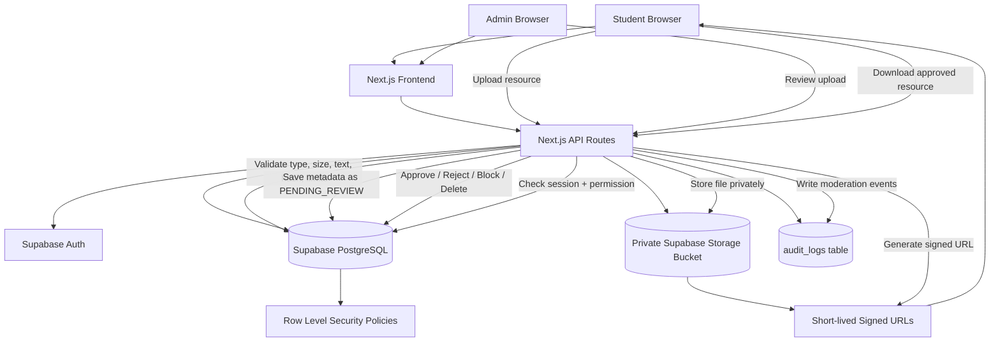
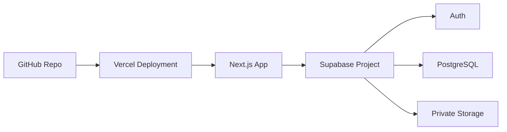

# Architecture

This document explains the security and runtime architecture of the Secure Campus Resource Sharing & Moderation Platform.

## High-level architecture



## Runtime flow

### 1. Registration and role assignment

```text
User registers
↓
Supabase Auth creates auth user
↓
profiles row is created
↓
If email is in ADMIN_EMAILS → ADMIN
Else → STUDENT
```

### 2. Upload moderation

```text
Student uploads academic resource
↓
Backend validates login, block status, upload limit, file type, file size, suspicious text, and duplicate hash
↓
File is stored in private Supabase Storage
↓
Metadata is stored in resources table
↓
status = PENDING_REVIEW
↓
Admin reviews and approves/rejects/blocks
```

### 3. Signed downloads

```text
User clicks Download
↓
Frontend calls /api/resources/[id]/download
↓
Backend checks whether the resource is approved, owned by user, or requested by admin
↓
Backend creates short-lived signed URL
↓
DOWNLOAD_CREATED audit log is created
```

## Security boundaries

- Frontend never receives `SUPABASE_SERVICE_ROLE_KEY`.
- Server-side API routes use service role key only for trusted backend operations.
- Supabase RLS policies protect application tables.
- Storage bucket is private and not publicly browsable.
- Downloads happen only through backend signed URL generation.
- Admin routes and APIs perform server-side role checks.
- Request body user IDs are not trusted; current user is derived from Supabase session.
- Audit logs track sensitive actions.

## Admin-only surfaces

- `/admin`
- `/admin/users`
- `/admin/duplicates`
- `/admin/audit`
- `/api/admin/*`

Students should never be able to access these routes or APIs.

## Data model summary

- `profiles`: user profile, role, blocked status, warning count.
- `resources`: uploaded resource metadata, status, storage key, hash, summary, uploader.
- `resource_requests`: login-only resource requests with 7-day expiry.
- `audit_logs`: security and moderation events.

## Deployment architecture


